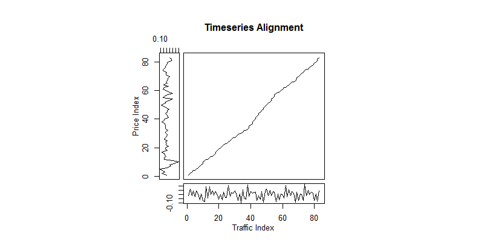

# Interactions of Fuel Prices, Traffic and Transportation in the Seattle Area #

### Thomas P Kiehne (9 Feb 2016) ###

------------------

## Introduction ##

The social and physical geography of the nation's cities has been radically transformed over the 125 some-odd year history of the automobile. This is especially true in the past 50 years as rural populations have become concentrated into urban and suburban populations.  The automobile enabled people to disengage aspects of their daily lives from proximity to those activities which has concomitant effects upon how people value distance, time and, especially, the allocation of their financial resources.  Indeed, having and using an automobile is effectively a requirement for modern life in most places.

As a result of this shift, people are now beholden to swings in the commodity cost of fuel as well as the  constrained availability of shared resources in densely populated areas such as road capacity and parking.  Urban governments have, to varying degrees, responded to the pressures on shared resources by increasing the reach and modes of public transportation. Public transportation affords those who reside close to such means of conveyance the ability to shift their personal resources from that of auto fuel, parking, and maintenance to transportation fares, often with the latter at a much lower cost than the former. In areas with such modal fluidity it could be reasoned that increases in the effective costs of one side of the transportation equation will result in defections to the other side.

The city and environs of Seattle meets the fluidity criteria.  The region is well developed with roads and highways that are constrained by the natural terrain of the area and no longer have room to expand.  This situation results in increased traffic congestion and travel times and is a prime motivation for transit development across the region.  Both King County and the Puget Sound region (via Sound Transit) are connected by a public bus network, van pools, rapid transit buses, and in the latter case, commuter and light rail. In fact, the light rail system is currently growing, with the promise of connecting most of the South Sound population centers. Additionally, Seattle has a number of dedicated bike paths and lanes that make bike commuting feasible for those within the city limits, particularly those beyond reasonable walking range of the city center.

This analysis looks at the interaction of gasoline fuel prices, road transportation, and alternative & public transportation available in and near Seattle.  It is theorized that increases in fuel prices will result in lower automobile usage as measured by traffic with a related increase in public transportation usage. The results of our analysis, however, are mixed and do not show such a definite effect.

## Data Sources and Description ##

The following data sources are used in the analysis:

### Consumer Gasoline Prices ###

The US Energy Information Administration publishes time series of historical averages for consumer gasoline fuel prices for various metropolitan areas [1].  We accessed both weekly and monthly time series for this analysis.  The distributions of the data are shown below.

The plots show a distinct seasonal component as well as several trend regions.  Notable features include rapid declines in price during the 2008 recession as well as the current price volatility as a result of international tensions. The rapid increase then decrease in 2014 is of particular interest as this time period is included in all of the other data sets explored here.

The distribution of the fuel prices is not perfectly normal but the mean (blue line) and median (red line) are tightly centered at about $3.00 per gallon. A normal distribution (dashed blue line) with the same mean and standard deviation is shown for reference.

### Road Traffic ###

Road traffic data are obtained from the Washington State Department of Transit which publishes estimated vehicle miles driven on State and Federal highways in Washington [2].  The data available for download contains numerous summaries as well as a detail of traffic estimates by county.  We were able to extract monthly vehicle mileage estimates for King county from 2008 onwards. Overall traffic for the county can be considered a reasonable proxy for commuter traffic in and around Seattle.  The distributions of the data are shown below

Here again we see a distinct seasonal trend as well as what appears to be a general upward trend.  The distribution density shows a distinct skew to the left with several peaks outside the center.  The mean and median are fairly close which implies a relatively small variance.

### Mass Transit ###

Mass transit data are available for several modes of transportation.  The first is Sound Transit's Link Light Rail, which currently serves Seattle from Seatac to downtown. Ridership summaries are available online [3] but time series data had to be requested through an FOIA request to the agency.  We obtained daily ridership data for the year 2014 for this analysis. The distributions are shown below.

We can clearly see that there are at least two seasonal periods in the data, yearly and most probably weekly (i.e.: weekend vs. weekday).  The distribution of data is roughly normal with some notable variance.

Next we have data from King County Metro which operates bus service, bus rapid transit, and van pools.  Strictly speaking, these modes of transportation use road networks and will likely be contained within the road data described above to some extent.  The difference in these modes as compared to private vehicle traffic is sufficient reason for them to be treated separately in the analysis. Aggregates of monthly boardings can be found on their Web site [4] but raw data must be “scraped” from their published documents. First we look at bus transit for which distributions are plotted below.

The data show a distinct seasonal variation and increasing trend. Distribution of the data are near normal with a significant peak and several troughs outside the center with some variance between the mean and median.

Bus rapid transit (or Rapid Ride) includes commuter buses on an express schedule using public road networks. The distributions of the data are shown below.

Rapid Ride data show a distinct increasing trend with low seasonality.  The trend is most likely due to the addition and extension of bus lines during the observation period.  The distribution shows a decidedly non-normal density with significant variance.

Finally, we have the King County Metro van pool program data as shown below.

Here we see a distinct seasonal trend with apparent upward trend. The distribution appears bivariate, and almost symmetrically so, with slight variance.  The bivariate appearance could likely be due to the distinct seasonal component.  

Note that we did not consider either of the streetcar routes within the city.  The South Lake Union Streetcar has been in operation since 2008 but as it only serves locations within the downtown and Lake Union core it does not present a significant alternative to car transport into the city and does not add to the modal fluidity that we are concerned with.  The First Hill Streetcar began operation during the course of the compilation of this study and does not yet have data available.

### Alternative Transportation ###

For alternative transportation we look at measurements of bike ridership at several points across the city as published on the City of Seattle's open data portal [5].  We looked at four significant bike transit points: Broadway bike track (Capitol Hill), Burke Gilman Trail (NE Seattle / Sand Point), Fremont Bridge, and Spokane Bridge (SODO / West Seattle).  Each of these routes carry bike commuters in addition to recreational cyclists and could contribute to modal fluidity.  The aggregate data distributions for all four routes are shown below:

The data show at least two seasonal components – yearly seasons as well as weekly (weekday / weekend) – and significant volatility, likely related to weather conditions.  The distribution of the data is significantly normal with some skew to the right and notable variance as a result.

## Assumptions ##

For this analysis we must make some assumptions, as follows:

* Fuel prices are exogenous and not subject to influence by any of the other variables.  Although it is possible for vehicle usage trends to influence gasoline prices in a national or global aggregate (think: better fuel efficiency, changes in population densities, etc.), such effects are much too small to be considered for just one metropolitan area over the time periods in question;
* All other variables are endogenous and could be dependent not only on the exogenous variable but on each other due to modal flexibility.  In fact, we already know of an explicit relationship between the various bus modes and van pools with the highway traffic data;
* Alternative fuel vehicle usage can be considered insignificant for this study although such technology will likely impact fuel prices and consumption in the decades to come;
* Increasing population in the study area affects all modes equally and can be ignored for this analysis;
* Other external variables, such as availability and cost of parking, denial of service due to construction, transit subsidies, and changes in service levels (e.g.: bus routes) will be ignored.

## Methodology ##

Our first null hypothesis for this study is that there is an inverse relationship between fuel prices and road traffic in Seattle such that when fuel prices increase, road traffic will decrease after some period of time.  The alternative to the first hypothesis is that there is no clear relationship between fuel prices and road traffic or that there are other confounding variables at work.

For the first null hypothesis we begin by examining the price and traffic data between January 2008 and December 2014 to determine fitness for modeling and analysis.  Tests for staionarity include Kwiatkowski-Phillips-Schmidt-Shin (KPSS, via `ndiffs()`) [7] and Osborn-Chui-Smith-Birchenhall (OCSB, via `nsdiffs()`) test for seasonal stability [7].  Once the data are confirmed stationary or modified via differences to compensate, we test for autocorrelation using the Durbin-Watson (DW) test [9] for autocorrelation of disturbances.  Next, a linear model will be generated and tested for normality using a Jarque-Bera test statistic [6].  Dynamic linear models [10] will be explored with lagged dynamics, harmonics, and trend. Finally, the model will be utilized in a test of Granger Causality [9], a technique used to determine if one time series predicts another, and in a Dynamic Time Warp (DTW) analysis [11], a technique that maps one time series to another.

Our second null hypothesis is that if there is a relationship between fuel prices and road traffic in Seattle, changes in fuel prices will also affect use of public transit and alternative transportation.  In this scenario, an increase in roaddfuel prices will correspond with an increase in transit and alternative transportation use as well as a decrease in road traffic.  The alternate hypothesis is that there is no correlation between changes in fuel prices and the use of other transportation or that other confounding variables are in play.

For the second hypothesis, we examine fuel, traffic, and transit data from Jan 2011 through December 2014 to determine if there are interactions between the various modes of transportation.  As in the first hypothesis, data tests for staionarity in the source data include Kwiatkowski-Phillips-Schmidt-Shin and Osborn-Chui-Smith-Birchenhall test for seasonal stability [7].  These tests are repeated on the traffic and price data due to the potential changes in form introduced by analyzing a different time frame than that of the first hypothesis. The stationary data are then processed using Vector Auto-Regression (VAR) [12], a technique for analyzing multivariate time series. The VAR model is subjected to various tests including for stationarity in the Eigenvalues of the VAR model, serial correlation in the residuals via asymptotic Portmanteau test, skewness and kurtosis in the residuals via multivariate Jargue-Bera tests, autoregressive serial heteroskedasticity via ARCH-LM, and stability in the Ordinary Least Squares Cumulative Sum (OLS CUSUM) of the residuals.  Upon confirmation of the VAR model, tests of Granger and instantaneous causality are performed to establish the causal relationships between fuel price and the endogenous road & transit variables.  Having verified the causal relationship, an Impulse Response Function (IRF) is computed and graphed to examine the effect of fuel price shocks on the model [13].

## Results ##

#### Fuel Prices and Traffic ####

For our first question – do fuel prices influence road traffic – we look at a monthly time series of fuel prices and road traffic from January 2008 through December 2014 as shown below.

Jargue-Bera tests show that both Traffic and Price data are not normal, with both skewness and excess kurtosis being non-zero. KPSS stationarity checks reveal that the Traffic data are stationary but that Price data are not, which is visually confirmed by the plot.  Augmented Dickey-Fuller unit root tests confirm that the Traffic data are stationary (no unit root, gamma=0) but not seasonally stationary (time term and possibly drift term present) and also asserts that the data do not reflect a random walk.  Similarly, ADF confirms that Price data have a unit root (not stationary) and that the data do not reflect a random walk, but are inconclusive about the presence of time and drift terms.

The checks just described indicate that both Traffic and Price data require processing to eliminate bias in seasonality (in the former case) and stationarity (in the latter).  For the remainder of the analysis we will use the first difference of the data as prescribed by the KPSS and OCSB tests.

Next we check for autocorrelation disturbances using a DW test against the formula Traffic ~ Avg.Price.  Without differencing the test rejects the null that the data have autocorrelation equal to zero.  Taking the first difference of the data reverses this result and DW does not detect autocorrelation.

A linear model is generated using the first differences of Traffic and Avg.Price as terms. A summary of the results indicates that diff(Avg.Price) is a statistically significant variable in predicting diff(Traffic) at 99.8% confidence.  A Jarque-Bera normality test on the model's residuals indicates normality. What is interesting, however, is that the slope of Avg.Price is positive at 0.356.

For further exploration, we generate a dynamic linear model that includes a lag term for Price using a standard lag specification. A test of the dynamic linear model reveals that the lagged term is not significant with only Avg.Price remaining as a significant term. The same is true when adding a term for trend.  Adding a harmonics term results in a slightly significant sine wave signal which can likely be explained by seasonal effects.  Regardless, no significant effects aside from the first difference of Price were found in any of these tests.

At this point we are confident that a relationship exists between Price and Traffic.  If we presume there is a cointegrated relationship we can proceed with tests of causality.  We run a Granger Causality test at lag order one against the first difference revealing a causal relationship with Price predicting Traffic at 99.8% confidence.  Switching the order of the terms in the Granger test confirms that the reverse is not true with a confidence level of only 6.2%.  

Encouraged by these results, we wish to see how much lag can be described by the system.  To do this we iterate through a set of lags and compute the Granger test for each lag.  The plot of the results are shown below.

On the left we see the distribution of test significance for the forward model (Traffic ~ Avg.Price), which is ideally minimized, and on the right the reverse relationship which is ideally maximized.  A significance level line is added for reference.  We see that the preferred model performs well at lag orders less than 3 while the reversed model does not perform significantly well at all, although it approaches significance at lags 4 and 10. This is a monthly time series so the results suggest that Price is influences Traffic at up to 2-3 months lag time.  

A final confirmation test is performed using DTW.  The first differences of Traffic and Price are optimized on a step-by-step basis to determine the optimal alignment between the two variables when accounting for time delay (or warp).  A plot of the time series alignment is shown below.

The plot shows a nearly linear alignment between the variables across the entire time series.  This represents the minimum distance - or cost- of matching the two series, with a straight 45-degree line indicating maximal matching. This plot lends further credibility to the time differenced relationship between Price and Traffic.

A similar analysis was also performed between price and bike transportation data using the same steps as above with the understanding that our hypothesis puts bike transportation as a second order effect of price changes behind road traffic.  This analysis could not verify a linear relationship or causality between price and bike usage.  This is intuitive given the second order relationship, but a more complex model might be able to capture a relationship.

#### Fuel Prices and Transit ####

For our first question – do fuel prices influence the road traffic and transit mix – we look at a monthly time series of fuel prices, road traffic, and various transit from January 2011 through December 2014 as shown below.

Staionarity and seasonality checks on the data subset determine that all variables except fuel price and bus transit require one order of differencing to compensate.  Bus transit requires two differences to compensate for both non-stationary and seasonal effects but average price remains unchanged for this time interval.

Having verified the stationarity of the data, we generate a VAR model with a dimensionality (K) of five and a deterministic trend regressor.  Estimation of the p-value for lag is at order five as reported by each of the tested criterion (AIC, HQ, SC, and FPE) which results in a VAR(5) model.  

An analysis of the VAR(5) model's Eigenvalues determines that there are no unit roots in the matrix and that most values are less than one.  Ideally we would have all values at less than one to ensure that the model is stationary, but we can assume for the purposes of this analysis that it is effectively stationary with the caveat that there could be some error due to our assumptions.  The model residuals do not exhibit serial correlation, skewness, or excess kurtosis.  Additionally, the model does not show any ARCH effects (autoregressive conditional heteroskedasticity) and none of the model's OLS cumulative sums show significant signs of instability as shown in the plot below:

Satisfied that the VAR(5) model is stable and valid, we can perform predictions and other tests with confidence.

The first test of the VAR(5) model is for Granger causality between fuel price and the endogenous variables.  Granger causality is confirmed as well as instantaneous causality, lending strength to the assertion of the hypothesis that traffic and transit are directly affected by fuel price.  Given this, we generate an IRF plot to examine the impacts of a positive price shock of unit one on the rates of change (differences) of the remaining variables as shown below:

From this we can see some unexpected things:

- A unit increase in fuel price seems to actually result in an increase in all traffic and transit modes at lag one (approx. one month)
- At lag two we see a decline in all modes except the bus rapid transit ridership;  curiously, the increase in Rapidride transit is accompanied by strong decreases in both bus transit and road traffic
- Traffic and all forms of transit except van pool normalize from lags three to six with the exception of van pool which takes an even sharper dip in usage before appearing to start to normalize by lag six

The increase in traffic at lag one could be predicted from the results of the first hypothesis as well as the continuing influence of the price shock through lags two to three (see the Granger test series above).  The exact magnitudes and directions of the transit fluctuations with respect to traffic make it difficult to understand exactly how the perturbations interact among the endogenous variables. A simpler model of transit that aggregates all modes (bus, van pool, rapid ride) into one metric might help us understand the changes better were it not for the unusual inversions that occur between transit modes.

## Conclusion ##

For the first hypothesis we have sufficient evidence to reject the null that there is an inverse relationship between fuel prices and road traffic.  Although a causal relationship is found using the linear model, the direction of change is slightly congruent instead of inverse.  It is likely that the linear model is insufficient for predicting effects that are delayed by, as the Granger series implies, as much as two to three months. Assuming no other significant variables are missing, exploration into a more robust model that supports delayed effects may support the null.

For the second hypothesis we have strong evidence that fuel price affects road and transit usage and that road and transit modes are cointegrated, thus failing to reject the null.  The IRF simulation demonstrates a small but definite delayed effect but the exact mechanisms the determine how these effects are distributed are unclear,  Further analysis is warranted to determine means of isolating the response variables to better understand the mechanism.  Additionally, the possibility that the VAR model is too narrow for this analysis must be explored given the slightly less than optimal values for the model's roots.

## Areas of Further Research ##

Several areas should be explored to improve and extend this analysis:

- Explore more robust models for delayed interactions between fuel price and traffic;
- Explore a more complex model for analyzing the interactions of fuel price on second order effects such as bike transportation;
- Examine the 2014-only series to determine why the VAR model is not valid; this is potentially due to a lack of data or some other functional limitation; to that end, the following will help improve data resolution:
- Obtain Link light rail data beyond 2014;
- Use SDOT road data; the data collected are difficult to interpret with respect to modelling local traffic but should, once appropriately cleaned, provide a reasonable proxy;
- Find or request weekly series for bus/transit and highway data.

## References ##

[1] https://www.eia.gov/dnav/pet/hist/LeafHandler.ashx?n=PET&s=EMM_EPM0_PTE_Y48SE_DPG&f=W

[2] http://www.wsdot.wa.gov/mapsdata/travel/annualtrafficreport.htm

[3] http://www.soundtransit.org/ridership

[4] http://metro.kingcounty.gov/am/reports/monthly-measures/ridership.html

[5] https://data.seattle.gov/

Bike data:
[Broadway Bike Track](https://data.seattle.gov/Transportation/Broadway-Cycle-Track-North-Of-E-Union-St/j4vh-b42a), 
[Burke Gilman Trail](https://data.seattle.gov/Transportation/Burke-Gilman-Trail-north-of-NE-70th-St-Bike-and-Pe/2z5v-ecg8), 
[Fremont Bridge](https://data.seattle.gov/Transportation/Fremont-Bridge-Hourly-Bicycle-Counts-by-Month-Octo/65db-xm6k), 
[Spokane Bridge](https://data.seattle.gov/Transportation/Spokane-St-Bridge-Counter/upms-nr8w)

[6] https://cran.r-project.org/web/packages/tseries/tseries.pdf

[7] https://cran.r-project.org/web/packages/forecast/forecast.pdf

[8] https://cran.r-project.org/web/packages/urca/urca.pdf

[9] https://cran.r-project.org/web/packages/lmtest/lmtest.pdf

[10] https://cran.r-project.org/web/packages/dynlm/dynlm.pdf

[11] https://cran.r-project.org/web/packages/dtw/dtw.pdf

[12] https://cran.r-project.org/web/packages/vars/vars.pdf

[13] http://ftp.uni-bayreuth.de/math/statlib/R/CRAN/doc/vignettes/vars/vars.pdf

--